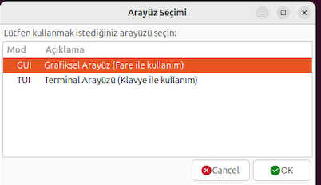
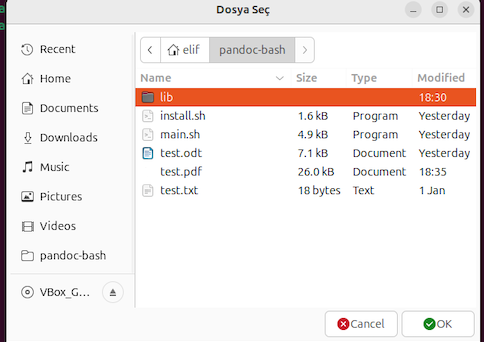
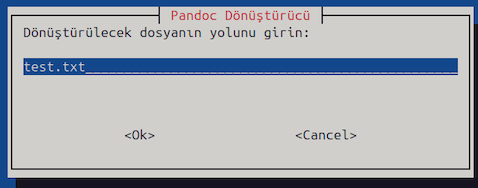
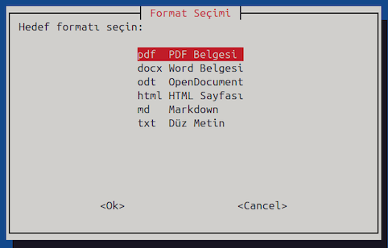
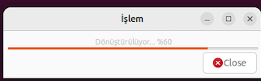

# 📄 Pandoc Belge Dönüştürücü (Bash Script)

  

Bu proje, **Pandoc** aracını kullanarak belgeleri farklı formatlar arasında dönüştürmek için geliştirilmiş, kullanıcı dostu bir Bash script uygulamasıdır. `YAD` kullanan bir **Grafiksel Kullanıcı Arayüzü (GUI)** ve `Whiptail` kullanan **Terminal Arayüzü (TUI)** sunarak kullanıcı ihtiyacına cevap verir.

Proje, **Pardus 23.0** (Debian tabanlı Linux dağıtımı) üzerinde geliştirilmiş ve test edilmiştir.

---

## 🚀 Özellikler

* **Çift Arayüz Desteği:**
    * **GUI Modu:** `YAD` kullanılarak oluşturulmuş, dosya seçici pencereleri ve ilerleme çubukları içeren grafik arayüz.
    * **TUI Modu:** `Whiptail` kullanılarak oluşturulmuş, terminal/konsol ortamında çalışan klavye tabanlı arayüz.
* **Otomatik Kurulum:** Gerekli tüm bağımlılıkları (Pandoc, LaTeX, YAD vb.) otomatik olarak tespit eden, eksikleri indiren ve yapılandıran bir `install.sh` scripti içerir.
* **Hata Yönetimi:**
    * Kullanıcı hatalı dosya yolu girdiğinde veya boş bırakıldığında program çökmez, uyarı vererek tekrar giriş ister.
    * Dosya varlığı ve format uyumluluğu kontrol edilir.
* **Format Desteği:** Aşağıdaki formatlar arasında dönüşüm yapılabilir:
    * PDF (`.pdf`)
    * Microsoft Word (`.docx`)
    * OpenDocument (`.odt`)
    * HTML Web Sayfası (`.html`)
    * Markdown (`.md`)
    * Düz Metin (`.txt`)
* **Görsel Geri Bildirim:** Dönüştürme işlemleri sırasında kullanıcıyı bilgilendiren ilerleme çubukları (Progress Bars).

---

## 🛠️ Gereksinimler

Bu proje Linux sistemleri için tasarlanmıştır. Aşağıdaki araçlar proje tarafından kullanılır (kurulum scripti bunları otomatik olarak indirir):

* `bash` (Komut satırı yorumlayıcısı)
* `pandoc` (Dönüştürme motoru)
* `yad` (GUI arayüzü için)
* `whiptail` (TUI arayüzü için)
* `texlive` paketleri (PDF oluşturmak için gerekli LaTeX motoru)

---

## 📥 Kurulum

Bağımlılıkların tek tek elle kurulmasına gerek yoktur. Kurulum scripti (**install.sh**) ile proje çalışmaya hazır hale gelir.

**1. Projeyi Klonlayın:**
```bash
git clone https://github.com/elifguv/pandoc-bash.git
cd pandoc-bash
```

**2. Kurulum Scriptini Çalıştırın:**
 
Yönetici (root) yetkisiyle kurulumu başlatın. Bu script eksik paketleri kontrol eder ve yükler.
```bash
sudo bash install.sh
```

**3. Programı Başlatın:**
```bash
./main.sh
```

## 📖 Kullanım
Script çalıştırıldığında sizi bir seçim menüsü karşılar:

**1. Arayüz Seçimi**

* GUI (Grafik Arayüz): Fare ile yönetilen pencereli mod.

* TUI (Terminal Arayüzü): Klavye ile yönetilen metin tabanlı mod.


<p align="center">
  
</p>

**2. Dosya Seçimi**

Dönüştürmek istediğiniz kaynak dosyayı seçin veya yolunu girin (Örnek: /home/kullanici/belge.txt). Olmayan bir dosya seçerseniz program sizi uyarır ve tekrar seçmenizi ister.

| GUI Modu (Grafik Arayüz) | TUI Modu (Terminal Arayüz) |
| :---: | :---: |
|  |  |

**3. Hedef Format Seçimi**

Listeden dönüştürmek istediğiniz formatı seçin (PDF, DOCX vb.).


<p align="center">
  
</p>

**4. Dönüştürme**

İşlem başlar ve ekranda ilerleme çubuğu görünür. İşlem bittiğinde yeni oluşturulan dosya kaynak dosya ile aynı dizine kaydedilir.


<p align="center">
  
</p>

## 📂 Proje Yapısı
```text
pandoc-bash/
├── install.sh          # Kurulum scripti (Bağımlılıkları ve izinleri ayarlar)
├── main.sh             # Ana program (Arayüz mantığını yönetir)
├── lib/
│   └── functions.sh    # Çekirdek fonksiyonlar (Pandoc komutları ve kontrolleri)
└── README.md           # Proje dokümantasyonu
```

## Katkıda Bulunma

Eğer aklınızda projeyi geliştirecek bir öneri varsa veya bir hata fark ettiyseniz katkıda bulunmaktan çekinmeyin. Yeni bir branch açın ve değişikliklerinizi gönderin :)

## 📄 Lisans
Bu proje MIT Lisansı altında lisanslanmıştır.

